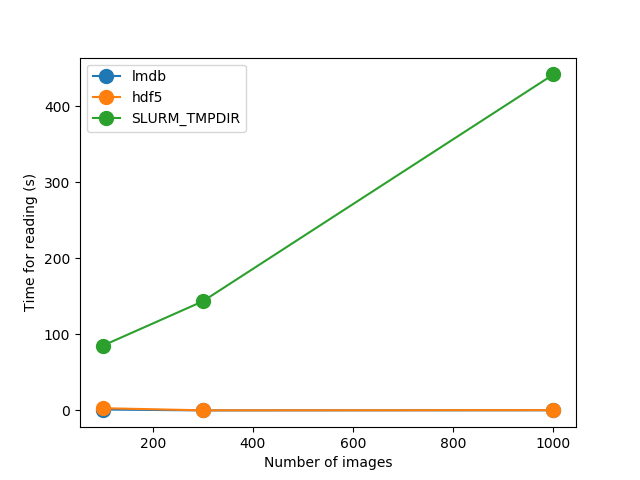
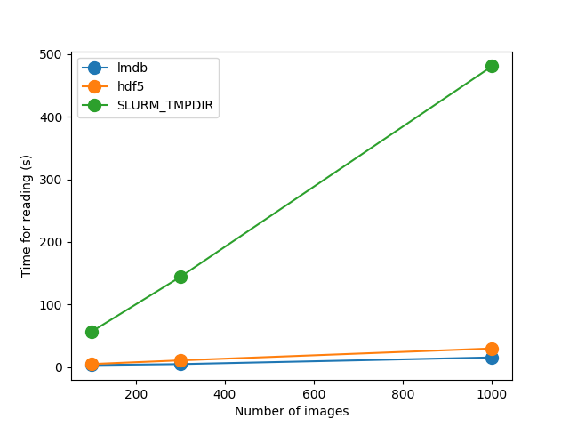
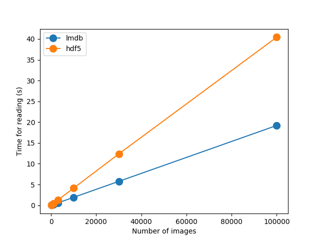
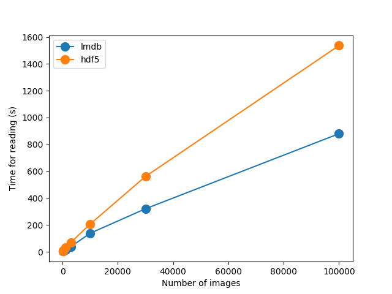
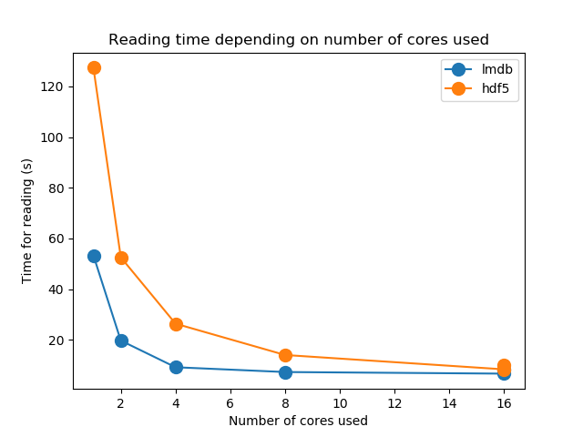
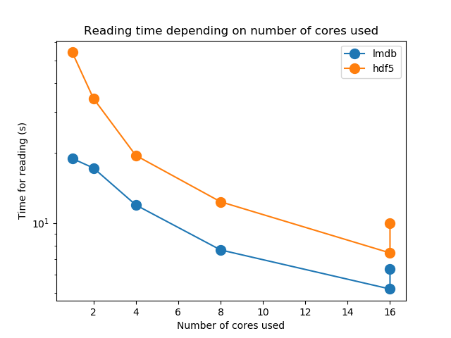

## Adjust reat_test.py

If needed adjust: random vs sequential, use/not SLURM_TMPDIR


## How it was run

```{bash}
srun --ntasks-per-node=1 --nodes 1 --mem=10GB -t1:00:00 --pty /bin/bash

module purge
module load  anaconda3/5.3.1
conda activate <env_name>

python3
```

```{python}
exec(open("read_test.py").read())
```


## Results


Sequential, including SLURM_TMPDIR

Time to extract tar.gz file to $SLURM_TMPDIR 
500 - 1300 sec (~ 8-20 min)

{'lmdb': [1.2103171348571777, 0.060796260833740234, 0.1916961669921875], 'hdf5': [2.9731316566467285, 0.15660810470581055, 0.41532135009765625], 'SLURM_TMPDIR': [85.01550245285034, 143.38232970237732, 441.6159420013428], 'N_to_read': [100, 300, 1000]}



Random access, including SLURM_TMPIDR

{'lmdb': [3.1788249015808105, 4.686114311218262, 15.420785427093506], 'hdf5': [4.800350189208984, 10.696107864379883, 29.679922103881836], 'SLURM_TMPDIR': [56.061922788619995, 143.91036319732666, 480.6018352508545], 'N_to_read': [100, 300, 1000]}



Sequential

{'lmdb': [0.022057294845581055, 0.05906391143798828, 0.19202971458435059, 0.5757067203521729, 1.9095697402954102, 5.7506163120269775, 19.195996046066284], 'hdf5': [0.045746564865112305, 0.12718486785888672, 0.4195220470428467, 1.247628927230835, 4.122635126113892, 12.351568222045898, 40.42858862876892], 'N_to_read': [100, 300, 1000, 3000, 10000, 30000, 100000]}




Random access


{'lmdb': [3.1335549354553223, 4.1236572265625, 13.481823205947876, 38.65831661224365, 138.04719758033752, 320.6217429637909, 879.8500552177429], 'hdf5': [5.039914846420288, 8.999412298202515, 30.702938318252563, 69.37561392784119, 206.54237270355225, 561.1213953495026, 1536.6684629917145], 'N_to_read': [100, 300, 1000, 3000, 10000, 30000, 100000]}




Sequential access, parallel


{'lmdb': [6.325052738189697, 5.198148488998413, 7.6550891399383545, 11.946351766586304, 17.232758045196533, 18.931683778762817], 'hdf5': [9.953233003616333, 7.430699825286865, 12.333068609237671, 19.512855291366577, 34.31105184555054, 54.162779331207275], 'cpus_options': [16, 16, 8, 4, 2, 1]}



And in the log scale




## Readign the whole data set

### hdf5

File size ~ 15 GB

* If use IMAGE open and then convert to array, the whole data set would require ~ 150 GB   
* If you read only binary representation of image to array, only about 15 GB of RAM is needed to store it. Read time is about 50 min in this case.Tradeoff: yes, you use less RAM, but need to convert from binary jpg representation to NumPy array when you want to use it


